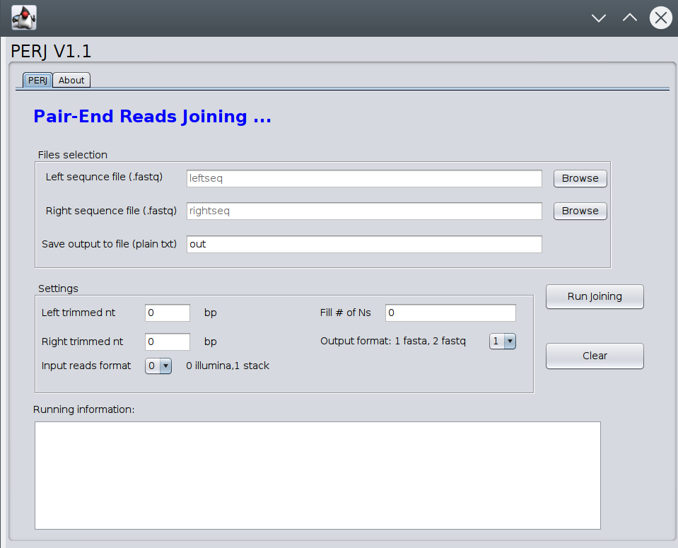

# PERJ
# Paired-End Reads Joining (PERJ)
Tool function: join two illumina paired-end reads from two files , with 5 end triming options, output in fasta (1) or fastq (2), filling in Ns between left and right reads, trim low quality reads

#input data are the name of two fastq files and options

# How to use this tool
The PERJ can be run in command line or graphic interface. Either is working.

## Usage for command terminal:
perl PERJ.pl [Options]

Options:
-l File:  Left reads file in fastq format

-r File:  Right reads file in fastq format

-format integer: 1 for output sequence in fasta or 2 for output sequence in fastq

-trimleft integer:  trim off how many of bp of nucleotides for the left read, default: 0

-trimright integer:  trim off how many of bp of nucleotides for the  right read, default: 0

-n integer: insert how many of bp of nucleotides into the gap between left and right reads, default: 0, for standard Illumina reads value 200 is recommended

## Example: 
A testing data comes with PERJ and run the following command in the terminal
`perl PERJ.pl -l TTGGATGG_1_50.fq -r TTGGATGG_2_50.fq -trimleft 1 -trimright 2 -format 1 -n 0 -o testOUT.txt`

## Usage for graph interface
to use , user can use one of floowing way:

1. `java -jar PERJ.jar`
2. double click the PERJ.jar to initiate the graphic version, then select the read files and run
Then you will see the following interface of PERJ

## Manual: Please see the pdf file
